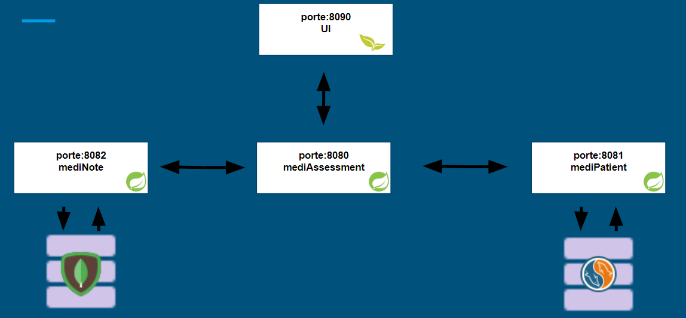
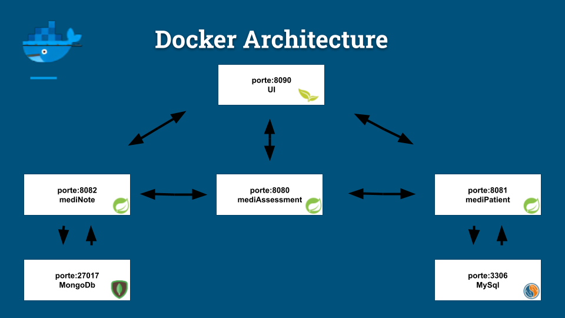
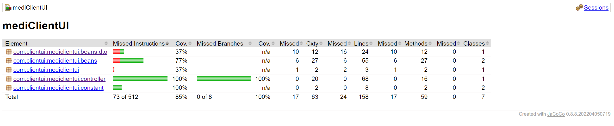
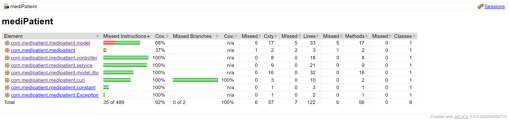
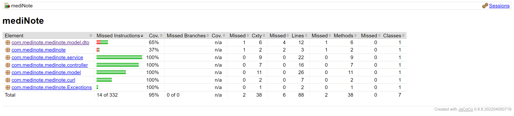
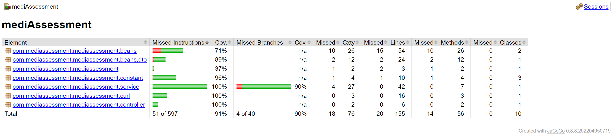

# p9Mediscreen
Application specialized in detecting risk factors for a disease!

Mediscreen is an application that allows to detect a level of risk of diabetes in a patient, based on his age, his sex and the different notes left by the doctor

---------
## Technical:

1.  JAVA 19
2.  Maven 3.8.6
3.  Spring Boot 3.0.1
4.  Spring Data JPA 2.7.10
5.  Spring Data MongoDB 3.4.10
6.  MySQL 8.0
7.  MongoDB 6.0
8.  H2 2.1.214
9.  Spring Cloud openfeign 4.0.2
10. Thymeleaf 2.7.2
11. Docker 23.0.5
12. bootstrap 4.0.0-2
13. Jacoco 0.8.8

---------

## Getting Started

### Running App

To run Mediscreen Application:

1. Install docker compose: https://docs.docker.com/compose/install/

2. Download the files that make up the project 

3. At the root of the project run this command via terminal the jar files for each microservice : `mvn install`

4. At the root of the project run this command via terminal to trigger docker-compose : `docker-compose up -d`

5. For the web interface follow this link `http://localhost:8090/`

6. To stop the application run the command : `docker-compose down`

### Testing

- To run the tests for each microservice and generate jacoco reports execute at the root of the project mvn test with the command: `mvn test`

---------
## Architecture

1. Microservice architecture
   

 

2. Docker architecture

---------
## Reports Jacoco

1. Report mediClientUi
   
2. Report mediPatient
      
3. Report mediNote
      
4. Report mediAssessment
      
